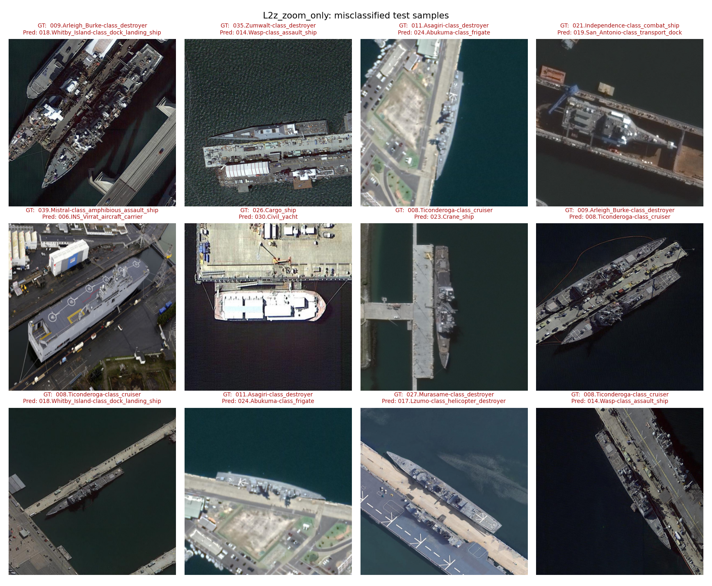

# Experiment ladder

Protocol: group-aware train/val/test split (60%/20%/20% of unique image groups per class); val mean-per-class top-1 picks the epoch, **test at that epoch is what is reported**. `±` is the std over seeds (ddof=1); a rung with one seed shows the mean only. The seed controls the split as well as the initialisation, so the spread includes split variance.

baseline = `L0`; Δ columns are absolute percentage points against it.

| id | backbone | img | aug | head | loss | seeds | overall top-1 | Δ | mean-per-class | Δ | MPC (support≥5) | macro-F1 | params (M) | s/epoch | Δ vs parent |
|---|---|---:|---|---|---|---:|---:|---:|---:|---:|---:|---:|---:|---:|---|
| L0 | resnet50 | 224 | basic | gap | ce | 3 | 97.54 ± 0.15 | +0.00 | 87.43 ± 1.37 | +0.00 | 95.66 ± 0.92 | 86.93 ± 1.28 | 23.59 | 3.7 | — |
| L0_naive_split | resnet50 | 224 | basic | gap | ce | 3 | 98.76 ± 0.13 | +1.22 | 90.22 ± 2.20 | +2.79 | 99.08 ± 0.49 | 89.58 ± 2.15 | 23.59 | 3.6 | `data.group_aware_split`: True→False |
| L1_320 | resnet50 | 320 | basic | gap | ce | 3 | 98.33 ± 0.50 | +0.79 | 87.60 ± 1.81 | +0.17 | 97.02 ± 2.16 | 87.40 ± 2.13 | 23.59 | 6.8 | `data.img_size`: 224→320 |
| L1_448 | resnet50 | 448 | basic | gap | ce | 3 | 98.41 ± 0.51 | +0.87 | 89.79 ± 2.17 | +2.37 | 96.76 ± 1.09 | 89.26 ± 3.23 | 23.59 | 12.1 | `data.img_size`: 224→448 |
| L2 | resnet50 | 448 | rs_rot | gap | ce | 3 | 98.34 ± 0.43 | +0.80 | 90.62 ± 2.31 | +3.20 | 97.11 ± 1.38 | 90.22 ± 2.90 | 23.59 | 13.3 | `data.aug`: basic→rs_rot |
| L2z_zoom_only | resnet50 | 448 | rs_zoom | gap | ce | 3 | 96.93 ± 0.61 | -0.61 | 87.59 ± 2.73 | +0.16 | 95.04 ± 1.63 | 87.06 ± 2.71 | 23.59 | 12.5 | `data.aug`: basic→rs_zoom |
| L3_compact_bilinear | resnet50 | 448 | rs_rot | compact_bilinear | ce | 3 | 96.21 ± 0.41 | -1.33 | 87.87 ± 2.47 | +0.44 | 93.15 ± 0.13 | 85.94 ± 1.52 | 23.85 | 14.2 | `model.head`: gap→compact_bilinear |
| L4_cbam | resnet50 | 448 | rs_rot | cbam | ce | 3 | 97.78 ± 0.99 | +0.24 | 90.08 ± 2.36 | +2.65 | 96.31 ± 1.07 | 88.98 ± 3.47 | 24.12 | 13.2 | `model.head`: gap→cbam |
| L5_cb_ce | resnet50 | 448 | rs_rot | gap | cb_ce | 3 | 98.10 ± 0.69 | +0.56 | 91.81 ± 1.16 | +4.39 | 97.62 ± 1.46 | 91.07 ± 1.98 | 23.59 | 13.3 | `loss.name`: ce→cb_ce |
| L6a_convnext_tiny | convnext_tiny | 448 | rs_rot | gap | ce | 3 | 99.09 ± 0.33 | +1.56 | 92.12 ± 1.06 | +4.69 | 98.36 ± 0.82 | 92.03 ± 1.45 | 27.85 | 13.3 | `model.name`: resnet50→convnext_tiny |
| L6b_vit_base_p16 | vit_base_patch16_384 | 448 | rs_rot | gap | ce | 3 | 98.31 ± 1.23 | +0.78 | 94.26 ± 0.77 | +6.83 | 98.58 ± 0.59 | 93.26 ± 0.57 | 86.28 | 22.9 | `model.name`: resnet50→vit_base_patch16_384 |

## Split per seed (group-aware rungs share it)

| seed | train | val | test | classes absent from val | absent from test |
|---:|---:|---:|---:|---:|---:|
| 0 | 4738 | 1558 | 1482 | 1 | 0 |
| 1 | 4634 | 1550 | 1594 | 1 | 0 |
| 2 | 4789 | 1512 | 1477 | 1 | 0 |

## Selection gap: val at its best epoch vs test at that epoch

val@best is the maximum of a noisy sequence and is therefore optimistic; the gap to test@best is the size of that optimism. It is what a val-only protocol would have over-reported by.

| id | best epochs | val MPC @best | test MPC @best | gap | val top-1 @best | test top-1 @best | gap |
|---|---|---:|---:|---:|---:|---:|---:|
| L0 | 24/14/56 | 90.39 | 87.43 | +2.96 | 97.28 | 97.54 | -0.26 |
| L0_naive_split | 29/36/57 | 92.74 | 90.22 | +2.53 | 98.91 | 98.76 | +0.15 |
| L1_320 | 38/24/53 | 92.87 | 87.60 | +5.27 | 98.33 | 98.33 | +0.00 |
| L1_448 | 17/25/16 | 92.21 | 89.79 | +2.42 | 98.67 | 98.41 | +0.27 |
| L2 | 39/54/37 | 90.18 | 90.62 | -0.44 | 97.92 | 98.34 | -0.42 |
| L2z_zoom_only | 28/25/42 | 89.30 | 87.59 | +1.71 | 96.77 | 96.93 | -0.16 |
| L3_compact_bilinear | 45/50/36 | 87.29 | 87.87 | -0.58 | 95.91 | 96.21 | -0.30 |
| L4_cbam | 41/37/11 | 91.23 | 90.08 | +1.15 | 97.11 | 97.78 | -0.67 |
| L5_cb_ce | 57/45/42 | 92.69 | 91.81 | +0.88 | 97.57 | 98.10 | -0.52 |
| L6a_convnext_tiny | 30/31/47 | 95.55 | 92.12 | +3.43 | 98.83 | 99.09 | -0.26 |
| L6b_vit_base_p16 | 29/47/38 | 96.76 | 94.26 | +2.50 | 98.61 | 98.31 | +0.30 |

## Converged-window check (test, mean of last 10 epochs)

If test@best and the converged test value disagree by more than the seed spread, the val-selected epoch is not representative of the trained model.

| id | test MPC @best | test MPC converged | Δ | test top-1 @best | test top-1 converged | Δ |
|---|---:|---:|---:|---:|---:|---:|
| L0 | 87.43 | 87.75 | -0.32 | 97.54 | 97.84 | -0.30 |
| L0_naive_split | 90.22 | 90.31 | -0.09 | 98.76 | 98.75 | +0.01 |
| L1_320 | 87.60 | 87.79 | -0.20 | 98.33 | 98.43 | -0.10 |
| L1_448 | 89.79 | 89.27 | +0.52 | 98.41 | 98.59 | -0.18 |
| L2 | 90.62 | 90.39 | +0.24 | 98.34 | 98.23 | +0.11 |
| L2z_zoom_only | 87.59 | 86.44 | +1.15 | 96.93 | 96.95 | -0.02 |
| L3_compact_bilinear | 87.87 | 88.25 | -0.38 | 96.21 | 96.26 | -0.06 |
| L4_cbam | 90.08 | 90.61 | -0.53 | 97.78 | 98.23 | -0.45 |
| L5_cb_ce | 91.81 | 92.35 | -0.54 | 98.10 | 98.12 | -0.02 |
| L6a_convnext_tiny | 92.12 | 92.96 | -0.84 | 99.09 | 99.11 | -0.02 |
| L6b_vit_base_p16 | 94.26 | 94.84 | -0.58 | 98.31 | 98.96 | -0.64 |

## Per-seed results (test at the val-selected epoch)

| id | seed | best epoch | overall top-1 | mean-per-class | MPC (support≥5) | macro-F1 | val MPC @best | commit |
|---|---:|---:|---:|---:|---:|---:|---:|---|
| L0 | 0 | 24 | 97.64 | 88.29 | 96.71 | 87.21 | 88.37 | bc73f71 |
| L0 | 1 | 14 | 97.62 | 88.15 | 95.07 | 88.04 | 89.59 | bc73f71 |
| L0 | 2 | 56 | 97.36 | 85.85 | 95.19 | 85.54 | 93.20 | bc73f71 |
| L0_naive_split | 0 | 29 | 98.65 | 91.21 | 98.52 | 90.89 | 93.75 | bc73f71 |
| L0_naive_split | 1 | 36 | 98.91 | 87.70 | 99.44 | 87.11 | 91.74 | bc73f71 |
| L0_naive_split | 2 | 57 | 98.72 | 91.75 | 99.28 | 90.75 | 92.74 | bc73f71 |
| L1_320 | 0 | 38 | 98.72 | 88.71 | 97.35 | 88.42 | 91.54 | bc73f71 |
| L1_320 | 1 | 24 | 98.49 | 88.57 | 99.00 | 88.82 | 93.59 | bc73f71 |
| L1_320 | 2 | 53 | 97.77 | 85.51 | 94.71 | 84.95 | 93.46 | bc73f71 |
| L1_448 | 0 | 17 | 98.58 | 88.62 | 97.22 | 86.91 | 91.74 | bc73f71 |
| L1_448 | 1 | 25 | 98.81 | 92.30 | 97.55 | 92.94 | 91.48 | bc73f71 |
| L1_448 | 2 | 16 | 97.83 | 88.46 | 95.51 | 87.92 | 93.41 | bc73f71 |
| L2 | 0 | 39 | 98.25 | 90.34 | 98.01 | 89.01 | 87.71 | bc73f71 |
| L2 | 1 | 54 | 98.81 | 93.07 | 97.79 | 93.53 | 94.42 | bc73f71 |
| L2 | 2 | 37 | 97.97 | 88.47 | 95.52 | 88.12 | 88.42 | bc73f71 |
| L2z_zoom_only | 0 | 28 | 96.90 | 89.23 | 96.34 | 87.44 | 88.09 | bc73f71 |
| L2z_zoom_only | 1 | 25 | 97.55 | 89.10 | 95.58 | 89.56 | 89.04 | bc73f71 |
| L2z_zoom_only | 2 | 42 | 96.34 | 84.43 | 93.21 | 84.19 | 90.77 | bc73f71 |
| L3_compact_bilinear | 0 | 45 | 95.95 | 90.68 | 93.17 | 87.70 | 87.50 | bc73f71 |
| L3_compact_bilinear | 1 | 50 | 95.98 | 86.08 | 93.01 | 85.18 | 86.70 | bc73f71 |
| L3_compact_bilinear | 2 | 36 | 96.68 | 86.85 | 93.26 | 84.95 | 87.66 | bc73f71 |
| L4_cbam | 0 | 41 | 97.50 | 89.24 | 96.36 | 87.97 | 89.54 | bc73f71 |
| L4_cbam | 1 | 37 | 98.87 | 92.75 | 97.35 | 92.84 | 94.46 | bc73f71 |
| L4_cbam | 2 | 11 | 96.95 | 88.25 | 95.21 | 86.12 | 89.69 | bc73f71 |
| L5_cb_ce | 0 | 57 | 97.37 | 91.41 | 96.05 | 90.34 | 92.80 | bc73f71 |
| L5_cb_ce | 1 | 45 | 98.75 | 93.12 | 97.86 | 93.32 | 94.37 | bc73f71 |
| L5_cb_ce | 2 | 42 | 98.17 | 90.91 | 98.94 | 89.56 | 90.90 | bc73f71 |
| L6a_convnext_tiny | 0 | 30 | 98.72 | 91.31 | 97.67 | 91.17 | 95.46 | bc73f71 |
| L6a_convnext_tiny | 1 | 31 | 99.31 | 91.74 | 99.27 | 91.21 | 97.08 | bc73f71 |
| L6a_convnext_tiny | 2 | 47 | 99.26 | 93.32 | 98.15 | 93.71 | 94.11 | bc73f71 |
| L6b_vit_base_p16 | 0 | 29 | 96.90 | 95.11 | 98.02 | 92.61 | 98.90 | bc73f71 |
| L6b_vit_base_p16 | 1 | 47 | 99.06 | 94.07 | 99.19 | 93.45 | 97.19 | bc73f71 |
| L6b_vit_base_p16 | 2 | 38 | 98.98 | 93.60 | 98.54 | 93.70 | 94.18 | bc73f71 |

## Most confusable class pairs on test (seed 0, top-15 per run)

### L0

| true | predicted | n | true support |
|---|---|---:|---:|
| 018.Whitby_Island-class_dock_landing_ship | 009.Arleigh_Burke-class_destroyer | 4 | 57 |
| 009.Arleigh_Burke-class_destroyer | 008.Ticonderoga-class_cruiser | 4 | 113 |
| 028.Container_ship | 026.Cargo_ship | 3 | 103 |
| 008.Ticonderoga-class_cruiser | 009.Arleigh_Burke-class_destroyer | 3 | 117 |
| 022.Sacramento-class_support_ship | 009.Arleigh_Burke-class_destroyer | 2 | 6 |
| 035.Zumwalt-class_destroyer | 013.Type_45_destroyer | 2 | 2 |
| 019.San_Antonio-class_transport_dock | 018.Whitby_Island-class_dock_landing_ship | 2 | 59 |
| 018.Whitby_Island-class_dock_landing_ship | 020.Freedom-class_combat_ship | 2 | 57 |
| 008.Ticonderoga-class_cruiser | 018.Whitby_Island-class_dock_landing_ship | 2 | 117 |
| 037.Horizon-class_destroyer | 019.San_Antonio-class_transport_dock | 1 | 1 |
| 026.Cargo_ship | 022.Sacramento-class_support_ship | 1 | 65 |
| 039.Mistral-class_amphibious_assault_ship | 023.Crane_ship | 1 | 1 |
| 023.Crane_ship | 001.Nimitz-class_aircraft_carrier | 1 | 25 |
| 011.Asagiri-class_destroyer | 038.Atago-class_destroyer | 1 | 17 |
| 011.Asagiri-class_destroyer | 012.Kidd-class_destroyer | 1 | 17 |

### L0_naive_split

| true | predicted | n | true support |
|---|---|---:|---:|
| 009.Arleigh_Burke-class_destroyer | 008.Ticonderoga-class_cruiser | 3 | 116 |
| 026.Cargo_ship | 033.Tank_ship | 2 | 76 |
| 018.Whitby_Island-class_dock_landing_ship | 009.Arleigh_Burke-class_destroyer | 2 | 56 |
| 011.Asagiri-class_destroyer | 016.Hyuga-class_helicopter_destroyer | 2 | 14 |
| 027.Murasame-class_destroyer | 011.Asagiri-class_destroyer | 1 | 13 |
| 037.Horizon-class_destroyer | 008.Ticonderoga-class_cruiser | 1 | 1 |
| 026.Cargo_ship | 030.Civil_yacht | 1 | 76 |
| 039.Mistral-class_amphibious_assault_ship | 014.Wasp-class_assault_ship | 1 | 1 |
| 018.Whitby_Island-class_dock_landing_ship | 019.San_Antonio-class_transport_dock | 1 | 56 |
| 011.Asagiri-class_destroyer | 027.Murasame-class_destroyer | 1 | 14 |
| 009.Arleigh_Burke-class_destroyer | 019.San_Antonio-class_transport_dock | 1 | 116 |
| 009.Arleigh_Burke-class_destroyer | 018.Whitby_Island-class_dock_landing_ship | 1 | 116 |
| 008.Ticonderoga-class_cruiser | 014.Wasp-class_assault_ship | 1 | 121 |
| 008.Ticonderoga-class_cruiser | 009.Arleigh_Burke-class_destroyer | 1 | 121 |
| 006.INS_Virrat_aircraft_carrier | 001.Nimitz-class_aircraft_carrier | 1 | 4 |

### L1_320

| true | predicted | n | true support |
|---|---|---:|---:|
| 009.Arleigh_Burke-class_destroyer | 008.Ticonderoga-class_cruiser | 3 | 113 |
| 022.Sacramento-class_support_ship | 009.Arleigh_Burke-class_destroyer | 2 | 6 |
| 035.Zumwalt-class_destroyer | 019.San_Antonio-class_transport_dock | 2 | 2 |
| 019.San_Antonio-class_transport_dock | 018.Whitby_Island-class_dock_landing_ship | 2 | 59 |
| 032.Sand_carrier | 024.Abukuma-class_frigate | 1 | 45 |
| 037.Horizon-class_destroyer | 009.Arleigh_Burke-class_destroyer | 1 | 1 |
| 022.Sacramento-class_support_ship | 008.Ticonderoga-class_cruiser | 1 | 6 |
| 026.Cargo_ship | 022.Sacramento-class_support_ship | 1 | 65 |
| 039.Mistral-class_amphibious_assault_ship | 001.Nimitz-class_aircraft_carrier | 1 | 1 |
| 011.Asagiri-class_destroyer | 038.Atago-class_destroyer | 1 | 17 |
| 008.Ticonderoga-class_cruiser | 018.Whitby_Island-class_dock_landing_ship | 1 | 117 |
| 008.Ticonderoga-class_cruiser | 009.Arleigh_Burke-class_destroyer | 1 | 117 |
| 005.Charles_de_Gaulle_aricraft_carrier | 001.Nimitz-class_aircraft_carrier | 1 | 1 |
| 002.KittyHawk-class_aircraft_carrier | 001.Nimitz-class_aircraft_carrier | 1 | 15 |

### L1_448

| true | predicted | n | true support |
|---|---|---:|---:|
| 022.Sacramento-class_support_ship | 009.Arleigh_Burke-class_destroyer | 3 | 6 |
| 032.Sand_carrier | 026.Cargo_ship | 2 | 45 |
| 009.Arleigh_Burke-class_destroyer | 018.Whitby_Island-class_dock_landing_ship | 2 | 113 |
| 009.Arleigh_Burke-class_destroyer | 010.Akizuki-class_destroyer | 2 | 113 |
| 008.Ticonderoga-class_cruiser | 009.Arleigh_Burke-class_destroyer | 2 | 117 |
| 026.Cargo_ship | 009.Arleigh_Burke-class_destroyer | 1 | 65 |
| 035.Zumwalt-class_destroyer | 014.Wasp-class_assault_ship | 1 | 2 |
| 037.Horizon-class_destroyer | 026.Cargo_ship | 1 | 1 |
| 035.Zumwalt-class_destroyer | 013.Type_45_destroyer | 1 | 2 |
| 023.Crane_ship | 001.Nimitz-class_aircraft_carrier | 1 | 25 |
| 039.Mistral-class_amphibious_assault_ship | 009.Arleigh_Burke-class_destroyer | 1 | 1 |
| 011.Asagiri-class_destroyer | 038.Atago-class_destroyer | 1 | 17 |
| 011.Asagiri-class_destroyer | 024.Abukuma-class_frigate | 1 | 17 |
| 009.Arleigh_Burke-class_destroyer | 008.Ticonderoga-class_cruiser | 1 | 113 |
| 005.Charles_de_Gaulle_aricraft_carrier | 007.INS_Vikramaditya_aircraft_carrier | 1 | 1 |

### L2

| true | predicted | n | true support |
|---|---|---:|---:|
| 009.Arleigh_Burke-class_destroyer | 008.Ticonderoga-class_cruiser | 7 | 113 |
| 008.Ticonderoga-class_cruiser | 014.Wasp-class_assault_ship | 3 | 117 |
| 035.Zumwalt-class_destroyer | 014.Wasp-class_assault_ship | 2 | 2 |
| 008.Ticonderoga-class_cruiser | 018.Whitby_Island-class_dock_landing_ship | 2 | 117 |
| 004.Kuznetsov-class_aircraft_carrier | 014.Wasp-class_assault_ship | 2 | 12 |
| 039.Mistral-class_amphibious_assault_ship | 006.INS_Virrat_aircraft_carrier | 1 | 1 |
| 029.Towing_vessel | 009.Arleigh_Burke-class_destroyer | 1 | 147 |
| 023.Crane_ship | 001.Nimitz-class_aircraft_carrier | 1 | 25 |
| 037.Horizon-class_destroyer | 026.Cargo_ship | 1 | 1 |
| 027.Murasame-class_destroyer | 017.Lzumo-class_helicopter_destroyer | 1 | 11 |
| 021.Independence-class_combat_ship | 020.Freedom-class_combat_ship | 1 | 43 |
| 011.Asagiri-class_destroyer | 038.Atago-class_destroyer | 1 | 17 |
| 011.Asagiri-class_destroyer | 024.Abukuma-class_frigate | 1 | 17 |
| 010.Akizuki-class_destroyer | 038.Atago-class_destroyer | 1 | 2 |
| 008.Ticonderoga-class_cruiser | 041.Maestrale-class_frigate | 1 | 117 |

### L2z_zoom_only

| true | predicted | n | true support |
|---|---|---:|---:|
| 009.Arleigh_Burke-class_destroyer | 008.Ticonderoga-class_cruiser | 5 | 113 |
| 008.Ticonderoga-class_cruiser | 014.Wasp-class_assault_ship | 5 | 117 |
| 027.Murasame-class_destroyer | 017.Lzumo-class_helicopter_destroyer | 4 | 11 |
| 026.Cargo_ship | 032.Sand_carrier | 3 | 65 |
| 011.Asagiri-class_destroyer | 024.Abukuma-class_frigate | 3 | 17 |
| 008.Ticonderoga-class_cruiser | 018.Whitby_Island-class_dock_landing_ship | 3 | 117 |
| 035.Zumwalt-class_destroyer | 014.Wasp-class_assault_ship | 2 | 2 |
| 009.Arleigh_Burke-class_destroyer | 018.Whitby_Island-class_dock_landing_ship | 2 | 113 |
| 009.Arleigh_Burke-class_destroyer | 010.Akizuki-class_destroyer | 2 | 113 |
| 008.Ticonderoga-class_cruiser | 023.Crane_ship | 2 | 117 |
| 039.Mistral-class_amphibious_assault_ship | 006.INS_Virrat_aircraft_carrier | 1 | 1 |
| 037.Horizon-class_destroyer | 026.Cargo_ship | 1 | 1 |
| 028.Container_ship | 023.Crane_ship | 1 | 103 |
| 029.Towing_vessel | 009.Arleigh_Burke-class_destroyer | 1 | 147 |
| 026.Cargo_ship | 030.Civil_yacht | 1 | 65 |

### L3_compact_bilinear

| true | predicted | n | true support |
|---|---|---:|---:|
| 027.Murasame-class_destroyer | 017.Lzumo-class_helicopter_destroyer | 6 | 11 |
| 009.Arleigh_Burke-class_destroyer | 008.Ticonderoga-class_cruiser | 6 | 113 |
| 020.Freedom-class_combat_ship | 008.Ticonderoga-class_cruiser | 5 | 33 |
| 009.Arleigh_Burke-class_destroyer | 018.Whitby_Island-class_dock_landing_ship | 5 | 113 |
| 008.Ticonderoga-class_cruiser | 014.Wasp-class_assault_ship | 5 | 117 |
| 023.Crane_ship | 001.Nimitz-class_aircraft_carrier | 4 | 25 |
| 030.Civil_yacht | 025.Megayacht | 2 | 164 |
| 021.Independence-class_combat_ship | 023.Crane_ship | 2 | 43 |
| 019.San_Antonio-class_transport_dock | 022.Sacramento-class_support_ship | 2 | 59 |
| 009.Arleigh_Burke-class_destroyer | 013.Type_45_destroyer | 2 | 113 |
| 008.Ticonderoga-class_cruiser | 018.Whitby_Island-class_dock_landing_ship | 2 | 117 |
| 008.Ticonderoga-class_cruiser | 009.Arleigh_Burke-class_destroyer | 2 | 117 |
| 004.Kuznetsov-class_aircraft_carrier | 039.Mistral-class_amphibious_assault_ship | 2 | 12 |
| 028.Container_ship | 009.Arleigh_Burke-class_destroyer | 1 | 103 |
| 022.Sacramento-class_support_ship | 011.Asagiri-class_destroyer | 1 | 6 |

### L4_cbam

| true | predicted | n | true support |
|---|---|---:|---:|
| 009.Arleigh_Burke-class_destroyer | 008.Ticonderoga-class_cruiser | 8 | 113 |
| 011.Asagiri-class_destroyer | 024.Abukuma-class_frigate | 5 | 17 |
| 008.Ticonderoga-class_cruiser | 014.Wasp-class_assault_ship | 4 | 117 |
| 027.Murasame-class_destroyer | 017.Lzumo-class_helicopter_destroyer | 3 | 11 |
| 019.San_Antonio-class_transport_dock | 022.Sacramento-class_support_ship | 2 | 59 |
| 008.Ticonderoga-class_cruiser | 018.Whitby_Island-class_dock_landing_ship | 2 | 117 |
| 039.Mistral-class_amphibious_assault_ship | 006.INS_Virrat_aircraft_carrier | 1 | 1 |
| 035.Zumwalt-class_destroyer | 014.Wasp-class_assault_ship | 1 | 2 |
| 035.Zumwalt-class_destroyer | 022.Sacramento-class_support_ship | 1 | 2 |
| 037.Horizon-class_destroyer | 026.Cargo_ship | 1 | 1 |
| 032.Sand_carrier | 026.Cargo_ship | 1 | 45 |
| 021.Independence-class_combat_ship | 020.Freedom-class_combat_ship | 1 | 43 |
| 011.Asagiri-class_destroyer | 038.Atago-class_destroyer | 1 | 17 |
| 010.Akizuki-class_destroyer | 038.Atago-class_destroyer | 1 | 2 |
| 009.Arleigh_Burke-class_destroyer | 018.Whitby_Island-class_dock_landing_ship | 1 | 113 |

### L5_cb_ce

| true | predicted | n | true support |
|---|---|---:|---:|
| 009.Arleigh_Burke-class_destroyer | 008.Ticonderoga-class_cruiser | 7 | 113 |
| 011.Asagiri-class_destroyer | 024.Abukuma-class_frigate | 5 | 17 |
| 027.Murasame-class_destroyer | 017.Lzumo-class_helicopter_destroyer | 4 | 11 |
| 009.Arleigh_Burke-class_destroyer | 018.Whitby_Island-class_dock_landing_ship | 4 | 113 |
| 008.Ticonderoga-class_cruiser | 018.Whitby_Island-class_dock_landing_ship | 3 | 117 |
| 008.Ticonderoga-class_cruiser | 014.Wasp-class_assault_ship | 3 | 117 |
| 035.Zumwalt-class_destroyer | 014.Wasp-class_assault_ship | 2 | 2 |
| 004.Kuznetsov-class_aircraft_carrier | 014.Wasp-class_assault_ship | 2 | 12 |
| 037.Horizon-class_destroyer | 026.Cargo_ship | 1 | 1 |
| 021.Independence-class_combat_ship | 023.Crane_ship | 1 | 43 |
| 019.San_Antonio-class_transport_dock | 008.Ticonderoga-class_cruiser | 1 | 59 |
| 011.Asagiri-class_destroyer | 038.Atago-class_destroyer | 1 | 17 |
| 010.Akizuki-class_destroyer | 038.Atago-class_destroyer | 1 | 2 |
| 009.Arleigh_Burke-class_destroyer | 027.Murasame-class_destroyer | 1 | 113 |
| 009.Arleigh_Burke-class_destroyer | 014.Wasp-class_assault_ship | 1 | 113 |

### L6a_convnext_tiny

| true | predicted | n | true support |
|---|---|---:|---:|
| 009.Arleigh_Burke-class_destroyer | 008.Ticonderoga-class_cruiser | 5 | 113 |
| 009.Arleigh_Burke-class_destroyer | 018.Whitby_Island-class_dock_landing_ship | 3 | 113 |
| 035.Zumwalt-class_destroyer | 008.Ticonderoga-class_cruiser | 2 | 2 |
| 014.Wasp-class_assault_ship | 001.Nimitz-class_aircraft_carrier | 2 | 90 |
| 004.Kuznetsov-class_aircraft_carrier | 009.Arleigh_Burke-class_destroyer | 2 | 12 |
| 022.Sacramento-class_support_ship | 009.Arleigh_Burke-class_destroyer | 1 | 6 |
| 037.Horizon-class_destroyer | 030.Civil_yacht | 1 | 1 |
| 022.Sacramento-class_support_ship | 023.Crane_ship | 1 | 6 |
| 039.Mistral-class_amphibious_assault_ship | 004.Kuznetsov-class_aircraft_carrier | 1 | 1 |
| 011.Asagiri-class_destroyer | 038.Atago-class_destroyer | 1 | 17 |

### L6b_vit_base_p16

| true | predicted | n | true support |
|---|---|---:|---:|
| 030.Civil_yacht | 009.Arleigh_Burke-class_destroyer | 5 | 164 |
| 009.Arleigh_Burke-class_destroyer | 008.Ticonderoga-class_cruiser | 5 | 113 |
| 030.Civil_yacht | 013.Type_45_destroyer | 4 | 164 |
| 030.Civil_yacht | 035.Zumwalt-class_destroyer | 4 | 164 |
| 030.Civil_yacht | 029.Towing_vessel | 3 | 164 |
| 009.Arleigh_Burke-class_destroyer | 023.Crane_ship | 3 | 113 |
| 030.Civil_yacht | 008.Ticonderoga-class_cruiser | 2 | 164 |
| 008.Ticonderoga-class_cruiser | 018.Whitby_Island-class_dock_landing_ship | 2 | 117 |
| 008.Ticonderoga-class_cruiser | 014.Wasp-class_assault_ship | 2 | 117 |
| 008.Ticonderoga-class_cruiser | 013.Type_45_destroyer | 2 | 117 |
| 030.Civil_yacht | 018.Whitby_Island-class_dock_landing_ship | 1 | 164 |
| 035.Zumwalt-class_destroyer | 013.Type_45_destroyer | 1 | 2 |
| 037.Horizon-class_destroyer | 023.Crane_ship | 1 | 1 |
| 027.Murasame-class_destroyer | 017.Lzumo-class_helicopter_destroyer | 1 | 11 |
| 021.Independence-class_combat_ship | 023.Crane_ship | 1 | 43 |

