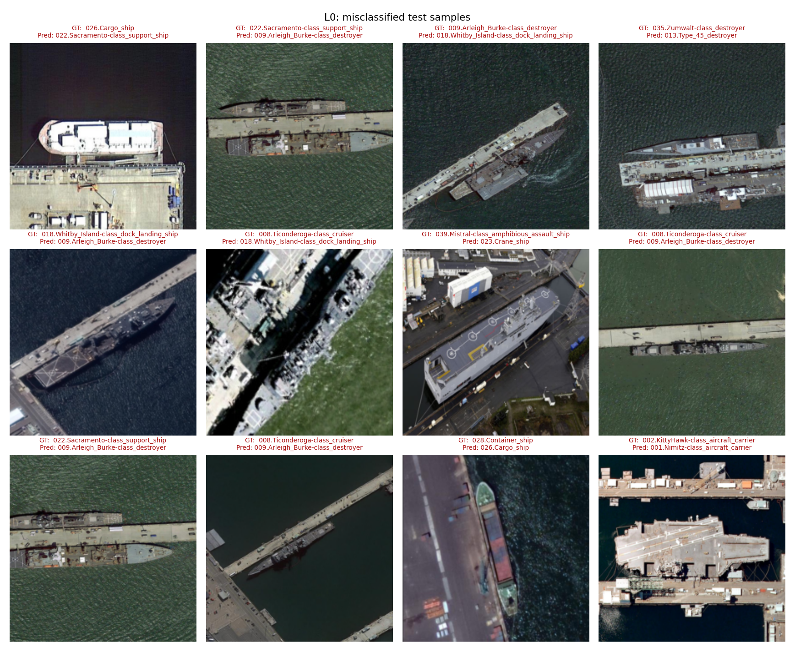
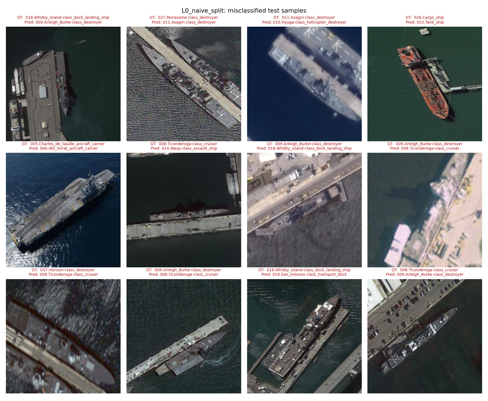
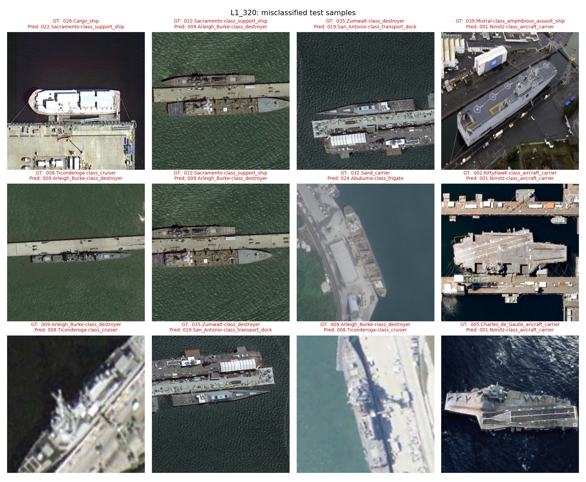
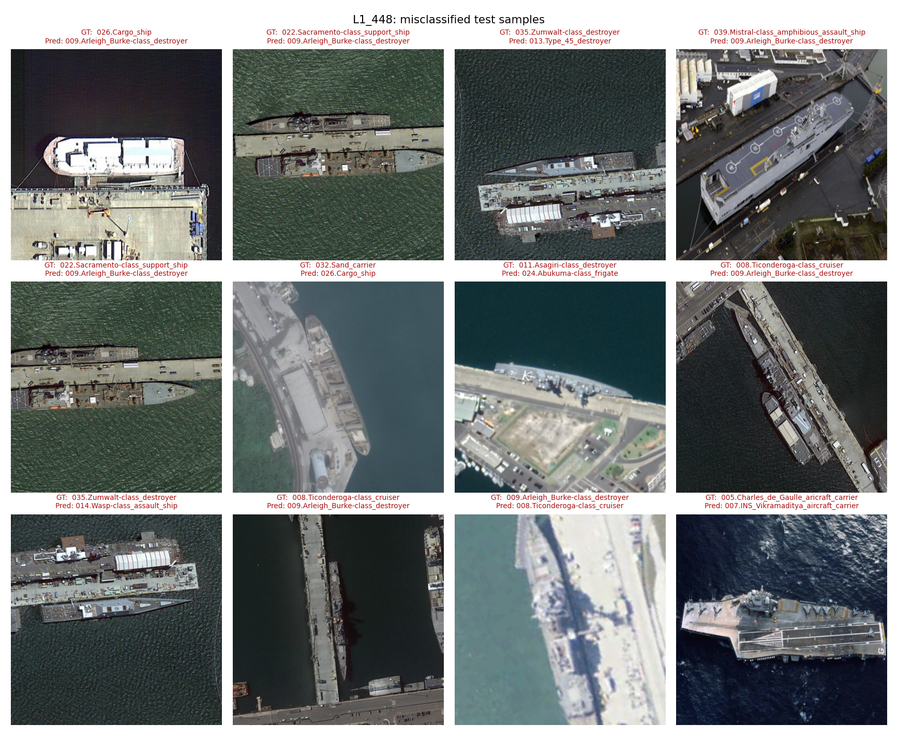
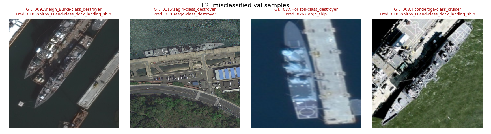
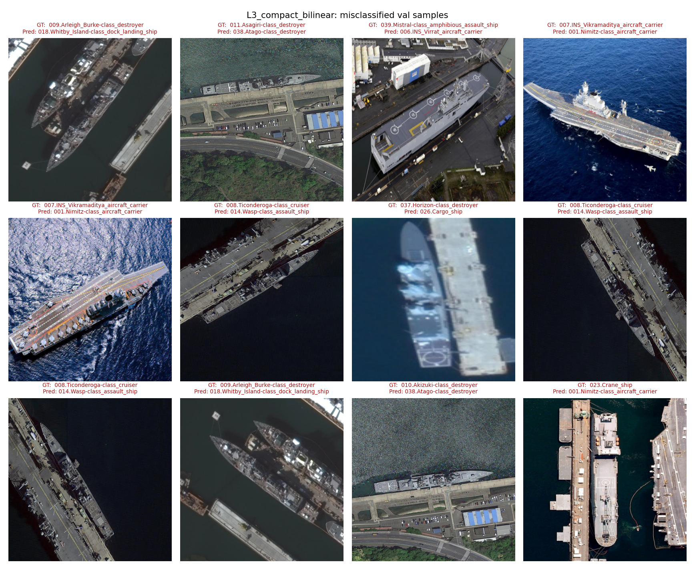
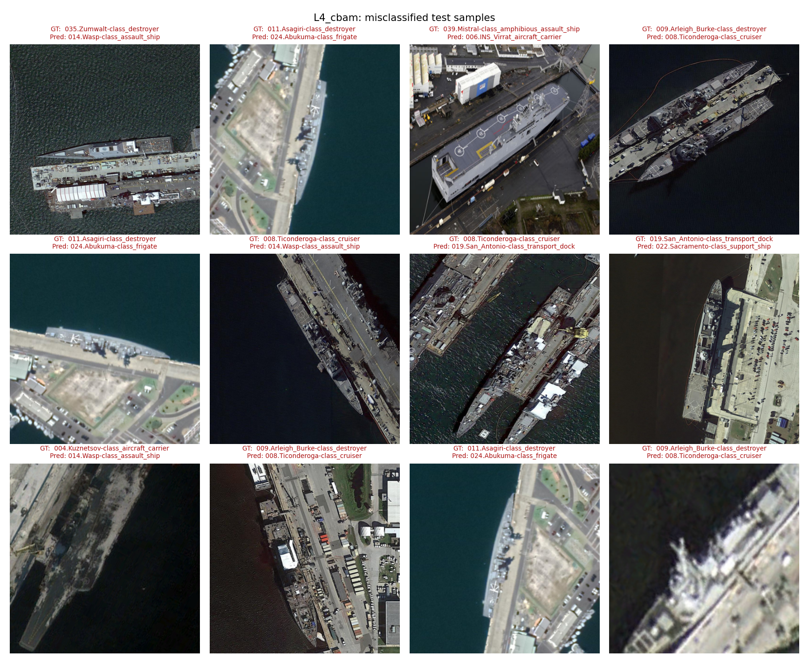
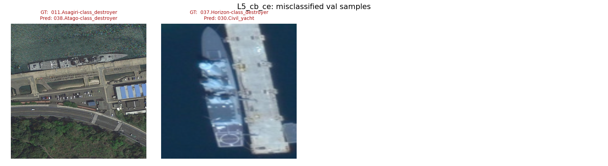
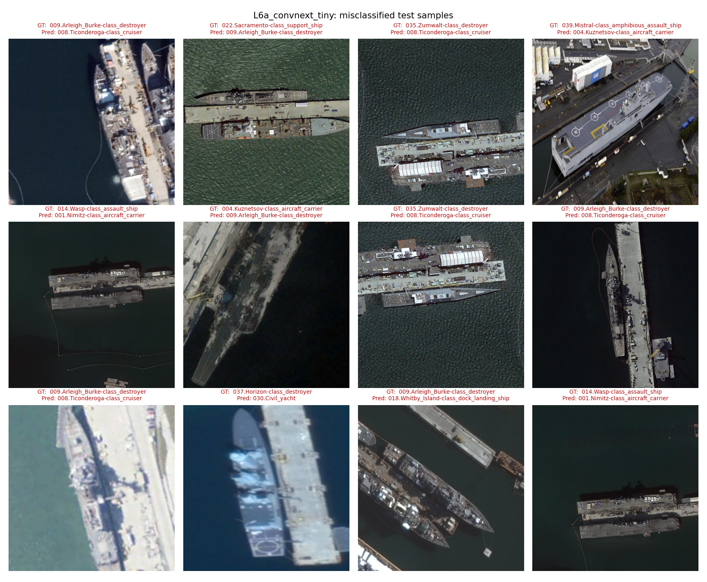
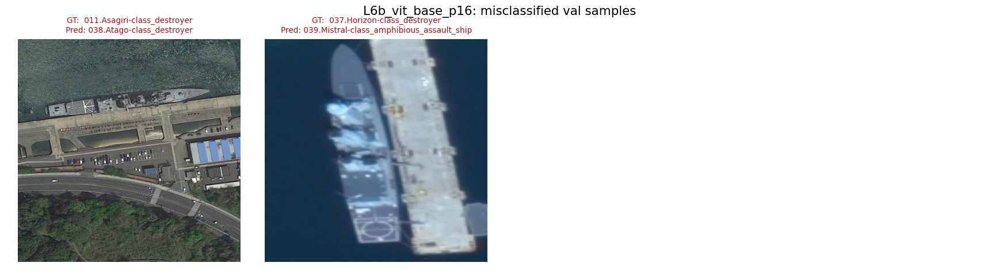

# Experiment ladder

Numbers are **converged values**: mean over the last 10 epochs. They are NOT the best epoch -- selecting the epoch and reporting the score on the same val split rewards whichever run happened to spike, and on this ladder that reverses three conclusions (see the selection-gap table below).

baseline = `L0`; Δ columns are absolute percentage points against it. `±` is epoch-to-epoch jitter across the final 10 epochs.

| id | backbone | img | aug | head | loss | seeds | overall top-1 | Δ | mean-per-class | Δ | MPC (support≥5) | macro-F1 | params (M) | s/epoch | Δ vs parent |
|---|---|---:|---|---|---|---:|---:|---:|---:|---:|---:|---:|---:|---:|---|
| L0 | resnet50 | 224 | basic | gap | ce | 1 | 98.45 ± 0.08 | +0.00 | 89.20 ± 0.60 | +0.00 | 97.04 ± 0.16 | 89.12 ± 0.44 | 23.59 | 7.9 | — |
| L0_naive_split | resnet50 | 224 | basic | gap | ce | 1 | 98.93 ± 0.08 | +0.48 | 90.16 ± 0.04 | +0.96 | 98.72 ± 0.06 | 90.41 ± 0.11 | 23.59 | 7.3 | `data.group_aware_split`: True→False |
| L1_320 | resnet50 | 320 | basic | gap | ce | 1 | 99.18 ± 0.04 | +0.72 | 90.96 ± 0.72 | +1.76 | 97.67 ± 0.04 | 91.53 ± 0.73 | 23.59 | 14.0 | `data.img_size`: 224→320 |
| L1_448 | resnet50 | 448 | basic | gap | ce | 1 | 99.40 ± 0.02 | +0.95 | 92.24 ± 0.02 | +3.04 | 99.13 ± 0.03 | 91.95 ± 0.02 | 23.59 | 26.0 | `data.img_size`: 224→448 |
| L2 | resnet50 | 448 | rs_rot | gap | ce | 1 | 99.76 ± 0.04 | +1.30 | 94.97 ± 0.36 | +5.77 | 99.79 ± 0.01 | 94.60 ± 0.24 | 23.59 | 26.0 | `data.aug`: basic→rs_rot |
| L3_compact_bilinear | resnet50 | 448 | rs_rot | compact_bilinear | ce | 1 | 99.04 ± 0.05 | +0.59 | 91.55 ± 0.11 | +2.36 | 98.17 ± 0.15 | 91.19 ± 0.12 | 23.85 | 31.1 | `model.head`: gap→compact_bilinear |
| L4_cbam | resnet50 | 448 | rs_rot | cbam | ce | 1 | 99.66 ± 0.06 | +1.21 | 94.44 ± 1.23 | +5.24 | 99.71 ± 0.04 | 94.76 ± 1.31 | 24.12 | 27.3 | `model.head`: gap→cbam |
| L5_cb_ce | resnet50 | 448 | rs_rot | gap | cb_ce | 1 | 99.82 ± 0.05 | +1.37 | 97.47 ± 0.02 | +8.28 | 99.79 ± 0.02 | 97.21 ± 0.09 | 23.59 | 23.1 | `loss.name`: ce→cb_ce |
| L6a_convnext_tiny | convnext_tiny | 448 | rs_rot | gap | ce | 1 | 99.69 ± 0.02 | +1.23 | 97.43 ± 0.00 | +8.23 | 99.73 ± 0.01 | 97.29 ± 0.00 | 27.85 | 23.4 | `model.name`: resnet50→convnext_tiny |
| L6b_vit_base_p16 | vit_base_patch16_224 | 448 | rs_rot | gap | ce | 1 | 99.79 ± 0.03 | +1.34 | 97.46 ± 0.01 | +8.27 | 99.78 ± 0.01 | 96.55 ± 0.01 | 86.28 | 50.4 | `model.name`: resnet50→vit_base_patch16_224 |

## Selection gap: val-selected best epoch vs converged

`best` is the epoch with the highest val mean-per-class, scored on that same val split -- the number the runs were originally reported with. `gap` is how much of it is the maximum of a noisy sequence rather than model quality. A rung whose val curve jitters more wins a comparison of maxima without being better.

| id | best-ep | MPC @best | MPC converged | gap | top-1 @best | top-1 converged | gap |
|---|---:|---:|---:|---:|---:|---:|---:|
| L0 | 42 | 90.27 | 89.20 | +1.07 | 98.62 | 98.45 | +0.16 |
| L0_naive_split | 7 | 92.23 | 90.16 | +2.07 | 98.46 | 98.93 | -0.48 |
| L1_320 | 28 | 92.69 | 90.96 | +1.73 | 99.31 | 99.18 | +0.13 |
| L1_448 | 13 | 92.81 | 92.24 | +0.57 | 99.10 | 99.40 | -0.30 |
| L2 | 30 | 97.46 | 94.97 | +2.49 | 99.79 | 99.76 | +0.03 |
| L3_compact_bilinear | 58 | 91.62 | 91.55 | +0.07 | 99.15 | 99.04 | +0.11 |
| L4_cbam | 54 | 96.27 | 94.44 | +1.84 | 99.73 | 99.66 | +0.07 |
| L5_cb_ce | 45 | 97.49 | 97.47 | +0.02 | 99.89 | 99.82 | +0.07 |
| L6a_convnext_tiny | 33 | 97.49 | 97.43 | +0.06 | 99.89 | 99.69 | +0.21 |
| L6b_vit_base_p16 | 43 | 97.49 | 97.46 | +0.03 | 99.89 | 99.79 | +0.10 |

## Most confusable class pairs (top-15 per run)

### L0

| true | predicted | n | true support |
|---|---|---:|---:|
| 026.Cargo_ship | 033.Tank_ship | 5 | 90 |
| 018.Whitby_Island-class_dock_landing_ship | 009.Arleigh_Burke-class_destroyer | 3 | 66 |
| 008.Ticonderoga-class_cruiser | 014.Wasp-class_assault_ship | 2 | 150 |
| 037.Horizon-class_destroyer | 019.San_Antonio-class_transport_dock | 1 | 1 |
| 039.Mistral-class_amphibious_assault_ship | 023.Crane_ship | 1 | 1 |
| 019.San_Antonio-class_transport_dock | 018.Whitby_Island-class_dock_landing_ship | 1 | 74 |
| 018.Whitby_Island-class_dock_landing_ship | 020.Freedom-class_combat_ship | 1 | 66 |
| 018.Whitby_Island-class_dock_landing_ship | 019.San_Antonio-class_transport_dock | 1 | 66 |
| 018.Whitby_Island-class_dock_landing_ship | 008.Ticonderoga-class_cruiser | 1 | 66 |
| 011.Asagiri-class_destroyer | 038.Atago-class_destroyer | 1 | 19 |
| 010.Akizuki-class_destroyer | 038.Atago-class_destroyer | 1 | 6 |
| 010.Akizuki-class_destroyer | 008.Ticonderoga-class_cruiser | 1 | 6 |
| 009.Arleigh_Burke-class_destroyer | 018.Whitby_Island-class_dock_landing_ship | 1 | 143 |
| 009.Arleigh_Burke-class_destroyer | 008.Ticonderoga-class_cruiser | 1 | 143 |
| 008.Ticonderoga-class_cruiser | 018.Whitby_Island-class_dock_landing_ship | 1 | 150 |

### L0_naive_split

| true | predicted | n | true support |
|---|---|---:|---:|
| 008.Ticonderoga-class_cruiser | 009.Arleigh_Burke-class_destroyer | 4 | 152 |
| 011.Asagiri-class_destroyer | 016.Hyuga-class_helicopter_destroyer | 3 | 18 |
| 009.Arleigh_Burke-class_destroyer | 018.Whitby_Island-class_dock_landing_ship | 3 | 145 |
| 009.Arleigh_Burke-class_destroyer | 038.Atago-class_destroyer | 2 | 145 |
| 009.Arleigh_Burke-class_destroyer | 008.Ticonderoga-class_cruiser | 2 | 145 |
| 026.Cargo_ship | 033.Tank_ship | 1 | 94 |
| 037.Horizon-class_destroyer | 008.Ticonderoga-class_cruiser | 1 | 1 |
| 027.Murasame-class_destroyer | 011.Asagiri-class_destroyer | 1 | 16 |
| 039.Mistral-class_amphibious_assault_ship | 025.Megayacht | 1 | 1 |
| 019.San_Antonio-class_transport_dock | 018.Whitby_Island-class_dock_landing_ship | 1 | 80 |
| 018.Whitby_Island-class_dock_landing_ship | 019.San_Antonio-class_transport_dock | 1 | 70 |
| 018.Whitby_Island-class_dock_landing_ship | 009.Arleigh_Burke-class_destroyer | 1 | 70 |
| 018.Whitby_Island-class_dock_landing_ship | 008.Ticonderoga-class_cruiser | 1 | 70 |
| 014.Wasp-class_assault_ship | 001.Nimitz-class_aircraft_carrier | 1 | 113 |
| 011.Asagiri-class_destroyer | 027.Murasame-class_destroyer | 1 | 18 |

### L1_320

| true | predicted | n | true support |
|---|---|---:|---:|
| 026.Cargo_ship | 033.Tank_ship | 2 | 90 |
| 010.Akizuki-class_destroyer | 038.Atago-class_destroyer | 2 | 6 |
| 035.Zumwalt-class_destroyer | 019.San_Antonio-class_transport_dock | 1 | 2 |
| 022.Sacramento-class_support_ship | 008.Ticonderoga-class_cruiser | 1 | 8 |
| 032.Sand_carrier | 026.Cargo_ship | 1 | 56 |
| 037.Horizon-class_destroyer | 009.Arleigh_Burke-class_destroyer | 1 | 1 |
| 019.San_Antonio-class_transport_dock | 018.Whitby_Island-class_dock_landing_ship | 1 | 74 |
| 011.Asagiri-class_destroyer | 038.Atago-class_destroyer | 1 | 19 |
| 009.Arleigh_Burke-class_destroyer | 008.Ticonderoga-class_cruiser | 1 | 143 |
| 007.INS_Vikramaditya_aircraft_carrier | 006.INS_Virrat_aircraft_carrier | 1 | 2 |
| 005.Charles_de_Gaulle_aricraft_carrier | 007.INS_Vikramaditya_aircraft_carrier | 1 | 2 |

### L1_448

| true | predicted | n | true support |
|---|---|---:|---:|
| 009.Arleigh_Burke-class_destroyer | 018.Whitby_Island-class_dock_landing_ship | 3 | 143 |
| 026.Cargo_ship | 033.Tank_ship | 2 | 90 |
| 010.Akizuki-class_destroyer | 038.Atago-class_destroyer | 2 | 6 |
| 008.Ticonderoga-class_cruiser | 009.Arleigh_Burke-class_destroyer | 2 | 150 |
| 032.Sand_carrier | 025.Megayacht | 1 | 56 |
| 026.Cargo_ship | 030.Civil_yacht | 1 | 90 |
| 023.Crane_ship | 001.Nimitz-class_aircraft_carrier | 1 | 33 |
| 032.Sand_carrier | 026.Cargo_ship | 1 | 56 |
| 039.Mistral-class_amphibious_assault_ship | 009.Arleigh_Burke-class_destroyer | 1 | 1 |
| 037.Horizon-class_destroyer | 026.Cargo_ship | 1 | 1 |
| 011.Asagiri-class_destroyer | 038.Atago-class_destroyer | 1 | 19 |
| 005.Charles_de_Gaulle_aricraft_carrier | 007.INS_Vikramaditya_aircraft_carrier | 1 | 2 |

### L2

| true | predicted | n | true support |
|---|---|---:|---:|
| 037.Horizon-class_destroyer | 026.Cargo_ship | 1 | 1 |
| 011.Asagiri-class_destroyer | 038.Atago-class_destroyer | 1 | 19 |
| 009.Arleigh_Burke-class_destroyer | 018.Whitby_Island-class_dock_landing_ship | 1 | 143 |
| 008.Ticonderoga-class_cruiser | 018.Whitby_Island-class_dock_landing_ship | 1 | 150 |

### L3_compact_bilinear

| true | predicted | n | true support |
|---|---|---:|---:|
| 023.Crane_ship | 001.Nimitz-class_aircraft_carrier | 3 | 33 |
| 008.Ticonderoga-class_cruiser | 014.Wasp-class_assault_ship | 3 | 150 |
| 010.Akizuki-class_destroyer | 038.Atago-class_destroyer | 2 | 6 |
| 009.Arleigh_Burke-class_destroyer | 018.Whitby_Island-class_dock_landing_ship | 2 | 143 |
| 007.INS_Vikramaditya_aircraft_carrier | 001.Nimitz-class_aircraft_carrier | 2 | 2 |
| 039.Mistral-class_amphibious_assault_ship | 006.INS_Virrat_aircraft_carrier | 1 | 1 |
| 037.Horizon-class_destroyer | 026.Cargo_ship | 1 | 1 |
| 011.Asagiri-class_destroyer | 038.Atago-class_destroyer | 1 | 19 |
| 008.Ticonderoga-class_cruiser | 018.Whitby_Island-class_dock_landing_ship | 1 | 150 |

### L4_cbam

| true | predicted | n | true support |
|---|---|---:|---:|
| 037.Horizon-class_destroyer | 021.Independence-class_combat_ship | 1 | 1 |
| 011.Asagiri-class_destroyer | 038.Atago-class_destroyer | 1 | 19 |
| 008.Ticonderoga-class_cruiser | 018.Whitby_Island-class_dock_landing_ship | 1 | 150 |
| 008.Ticonderoga-class_cruiser | 001.Nimitz-class_aircraft_carrier | 1 | 150 |
| 007.INS_Vikramaditya_aircraft_carrier | 001.Nimitz-class_aircraft_carrier | 1 | 2 |

### L5_cb_ce

| true | predicted | n | true support |
|---|---|---:|---:|
| 037.Horizon-class_destroyer | 030.Civil_yacht | 1 | 1 |
| 011.Asagiri-class_destroyer | 038.Atago-class_destroyer | 1 | 19 |

### L6a_convnext_tiny

| true | predicted | n | true support |
|---|---|---:|---:|
| 037.Horizon-class_destroyer | 032.Sand_carrier | 1 | 1 |
| 011.Asagiri-class_destroyer | 038.Atago-class_destroyer | 1 | 19 |

### L6b_vit_base_p16

| true | predicted | n | true support |
|---|---|---:|---:|
| 037.Horizon-class_destroyer | 039.Mistral-class_amphibious_assault_ship | 1 | 1 |
| 011.Asagiri-class_destroyer | 038.Atago-class_destroyer | 1 | 19 |

